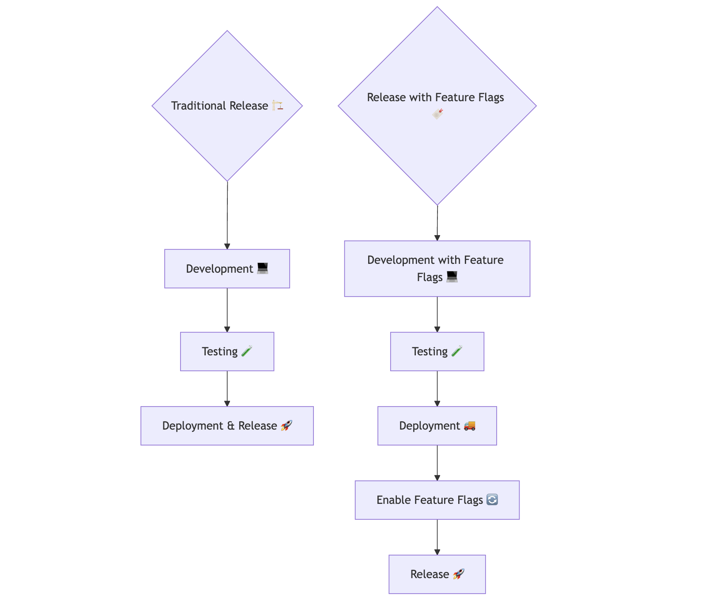
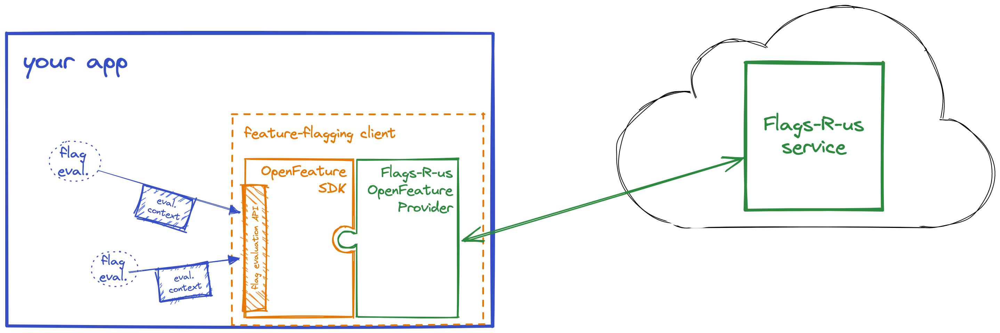
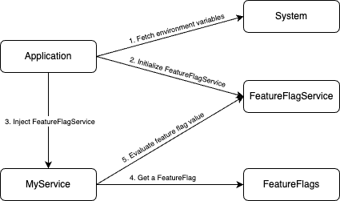

Hello! I'm Firdaus Al Ghifari (Alghi), a full-stack software engineer at Money Forward Cloud Payroll, HR Solutions Department. I specialize in React, Ruby, and Kotlin. Recently, our team embarked on an exciting journey to migrate our backend system from Ruby on Rails to Kotlin. As part of this transition, we decided to adopt OpenFeature as our feature flag interface. Initially, we envisioned creating a dedicated feature flag service. However, considering the additional development and budget required, we opted to start small by leveraging environment variable-based feature flags.

In this article, I'll share our team's journey exploring feature flags - from understanding their fundamental concepts to examining various implementation approaches. We'll dive into the costs and benefits of our chosen solution, and provide a practical guide for teams looking to implement similar systems. By the end, you'll also learn about the challenges we faced and our vision for the future of feature flag development in our organization.

### Understanding Feature Flags



Before diving into our implementation, let's explore what feature flags are and why they're essential. According to "The Art of Agile Development" book by James Shore, feature flags, also known as feature toggles, allow teams to deploy and release independently. In many traditional setups, releasing software is synonymous with deploying it. Teams deploy a branch of their code repository into production, and everything in that branch is released.

However, this approach doesn't align well with continuous integration and deployment practices. Teams using these methodologies frequently push their changes into a single branch—their integration branch—leaving no room to hide unfinished work. Feature flags address this challenge by hiding code programmatically rather than using repository branches. This enables teams to deploy unfinished code without releasing it.

Feature flags can be implemented through several common approaches. These include configuration files (like YAML or JSON), database tables, environment variables, or dedicated feature management services.

Environment variable-based feature flags offer a pragmatic starting point for teams adopting feature flag management. This approach comes with several advantages:

- **Zero Additional Infrastructure**: Since environment variables are supported natively by all major platforms and deployment tools, there's no need for additional databases or services.
- **Simple Configuration**: Teams can easily modify flags through deployment configurations or container orchestration platforms like Kubernetes.
- **Cost-Effective**: Unlike commercial feature management services, there are no licensing fees or additional operational costs.
- **Deployment-Time Control**: Feature flags can be adjusted during deployment, making it ideal for teams with predictable release cycles.

However, this approach also has limitations to consider:

- **No Runtime Updates**: Changes to feature flags require redeployment of the application.
- **Limited Targeting**: Without additional logic, you can't easily target specific users or segments.
- **Basic Feature Set**: Advanced capabilities like A/B testing or gradual rollouts require custom implementation.
- **Manual Tracking**: There's no built-in analytics for feature flag usage or impact.

For many teams, these tradeoffs are acceptable in the early stages of feature flag adoption, making environment variables an excellent choice for getting started with feature flag management.

### The Challenge of Transitioning to Kotlin



*Image source: [OpenFeature Documentation](https://openfeature.dev/docs/reference/intro)*

During our transition from Ruby on Rails to Kotlin, implementing feature flags presented unique challenges. We needed a solution that would be both robust and maintainable as our codebase grew. After evaluating several approaches, we chose OpenFeature for its flexibility and standardized API.

OpenFeature offered three key advantages that aligned with our needs:

1. **Provider Abstraction**: OpenFeature's provider-based architecture allowed us to start with simple environment variables while keeping the door open for more sophisticated providers in the future.

2. **Type Safety**: Unlike our Ruby implementation, Kotlin's strong typing helped us catch feature flag configuration errors at compile time rather than runtime.

3. **Testing Support**: The architecture made it straightforward to mock feature flags in our test environment, improving our testing coverage and reliability.

This approach gave us the flexibility to evolve our feature flag system alongside our growing Kotlin codebase. Whether we decide to migrate to enterprise solutions like LaunchDarkly, open-source alternatives like Flipt, or build our own service, the application code remains unchanged thanks to OpenFeature's provider interface.

### Integrating Kotlin with OpenFeature



Let's explore how we integrated OpenFeature with the Environment Variable Provider in our Kotlin system.

To make it easier, I have created a repository containing the complete implementation, usage examples, and testing. You can always check it out at https://github.com/falghi/openfeature_example for reference.

The first step is to create a new module or package and add the required dependencies in your `build.gradle.kts`.

```kotlin
dependencies {
    implementation("dev.openfeature:sdk:1.12.0")
    implementation("dev.openfeature.contrib.providers:env-var:0.0.7")
}
```

After setting up the dependencies, we'll create the necessary classes to handle feature flag management. The setup involves configuring the OpenFeature SDK with our custom environment gateway and initializing the feature flag service.

First, we create an OpenFeature client configured with the Environment Variable Provider:

#### FeatureFlag Class

The `FeatureFlag` class is designed to store the feature flag's name and default value. It ensures that the default value is a primitive type, such as Boolean, String, Int, or Double.

```kotlin
package com.falghifari.featureflag

class FeatureFlag<T>(
    val name: String,
    val defaultValue: T
) {
    init {
        if (defaultValue !is Boolean && defaultValue !is String && defaultValue !is Int && defaultValue !is Double) {
            throw IllegalArgumentException("Flag defaultValue must be a primitive type (Boolean, String, Int, Double)")
        }
    }
}

```

#### FeatureFlagService Class

The `FeatureFlagService` class interacts with the OpenFeature client to retrieve the feature flag values based on their types. We only implemented the basic functionality below, please refer to the [OpenFeature Java SDK](https://github.com/open-feature/java-sdk) for more details.

```kotlin
package com.falghifari.featureflag

import dev.openfeature.sdk.Client

class FeatureFlagService(private val client: Client) {
    fun getValue(flag: FeatureFlag<Boolean>): Boolean = client.getBooleanValue(flag.name, flag.defaultValue)

    fun getValue(flag: FeatureFlag<String>): String = client.getStringValue(flag.name, flag.defaultValue)

    fun getValue(flag: FeatureFlag<Int>): Int = client.getIntegerValue(flag.name, flag.defaultValue)

    fun getValue(flag: FeatureFlag<Double>): Double = client.getDoubleValue(flag.name, flag.defaultValue)
}
```

### Leveraging Environment Variables

To utilize environment variable-based feature flags, we needed a mechanism to fetch the feature flag values from environment variables. OpenFeature provides an Environment Variable Provider, but we extended it with a custom environment gateway. Please refer to the [OpenFeature Java Environment Variable Provider](https://github.com/open-feature/java-sdk-contrib/tree/main/providers/env-var) for more details.

#### CustomEnvironmentGateway Class

Let's create a `CustomEnvironmentGateway` class that implements the `EnvironmentGateway` interface. This class will be used to fetch the feature flag values from environment variables.

```kotlin
package com.falghifari.featureflag.envvar

import dev.openfeature.contrib.providers.envvar.EnvironmentGateway

class CustomEnvironmentGateway(private val envVariables: Map<String, String>) : EnvironmentGateway {
    override fun getEnvironmentVariable(key: String): String? = envVariables[key]
}
```

#### EnvVarClientFactory Class

To simplify developer experience, we created a helper class to build the environment variable client.

```kotlin
package com.falghifari.featureflag.envvar

import dev.openfeature.contrib.providers.envvar.EnvVarProvider
import dev.openfeature.sdk.Client
import dev.openfeature.sdk.OpenFeatureAPI

class EnvVarClientFactory(
    private val envVariables: Map<String, String>,
    private val domain: String = "env-var"
) {
    fun build(): Client {
        val customEnvironmentGateway = CustomEnvironmentGateway(envVariables)
        val envVarProvider = EnvVarProvider(customEnvironmentGateway)

        OpenFeatureAPI.getInstance().setProviderAndWait(domain, envVarProvider)

        return OpenFeatureAPI.getInstance().getClient(domain)
    }
}
```

### Integrating Feature Flags in the Application

Developers can set up the feature flag service during application startup and inject the `FeatureFlagService` into the desired classes.

**Application Startup:**

```kotlin
val featureFlagClient = EnvVarClientFactory(System.getenv()).build()
val featureFlagService = FeatureFlagService(featureFlagClient)

// Inject the feature flag service into your service class
myService(featureFlagService)
```

Feature flag list can be defined as a global variable or singleton in a dedicated file within each module.

**FeatureFlags.kt:**

Define a feature flag with its name and default value.

```kotlin
val FEATURE_FOO_ENABLED = FeatureFlag("FEATURE_FOO_ENABLED", false)
```

To use a feature flag, developers can simply call the feature flag service from their service class:

```kotlin
// In your service class
if (featureFlagService.getValue(FEATURE_FOO_ENABLED)) {
    // do something
} else {
    // do something else
}
```

For testing, you can easily mock the feature flag service using [MockK](https://mockk.io/) or any other mocking framework:

```kotlin
// In your test file
val featureFlagService = mockk<FeatureFlagService>()
every { featureFlagService.getValue(FEATURE_FOO_ENABLED) } returns true
```

That's all! We've successfully implemented feature flags in our Kotlin application using OpenFeature. Try to use the feature flag service in your application and see how it works.

### What's Next

Feature flags open up new possibilities, particularly for Product and Operations teams. In an ideal scenario, developers would focus solely on developing and deploying products with feature flags, leaving the release process to both product and operations teams. This empowers product teams to toggle feature flags for business experiments and operations teams to manage technical rollouts, facilitating A/B testing, canary releases, and infrastructure changes for specific user groups.

For the Product team, the traditional approach of extensive pre-release research is becoming obsolete. Feature flags enable lean experimentation, allowing teams to validate hypotheses through real user data and make informed decisions with minimal investment of time and resources.

### Challenges with Feature Flags

While feature flags offer numerous benefits, they also introduce certain challenges:

- **Complexity in Functions:** Adding feature flags can complicate functions, especially when multiple flags are involved. This increases the risk of errors, particularly if flags are applied to reusable functions without considering scenarios where some flags are on and others are off. Martin Fowler recommends removing feature flags no more than a week or two after a product is released to mitigate this complexity.

- **Release and Rollback Considerations:** Teams must plan for scenarios where a feature flag is turned on, users interact with the feature, and then the flag is turned off. This requires careful planning of release and rollback strategies to ensure a smooth user experience.

- **Not Everything Needs a Feature Flag:** As James Shore explains, sometimes it's more effective to use keystones—deploying backend functionalities first and wiring up the UI later—rather than relying on feature flags. This approach can simplify the development process and reduce unnecessary complexity.

### Wrapping Up

Thank you for reading this article 😄. If you have any questions, you can reach me via [LinkedIn](https://www.linkedin.com/in/alghi/) or other social media platforms.

Follow our [LinkedIn page](https://www.linkedin.com/company/money-forward/) so not to miss any blog and updates.

Happy coding!
