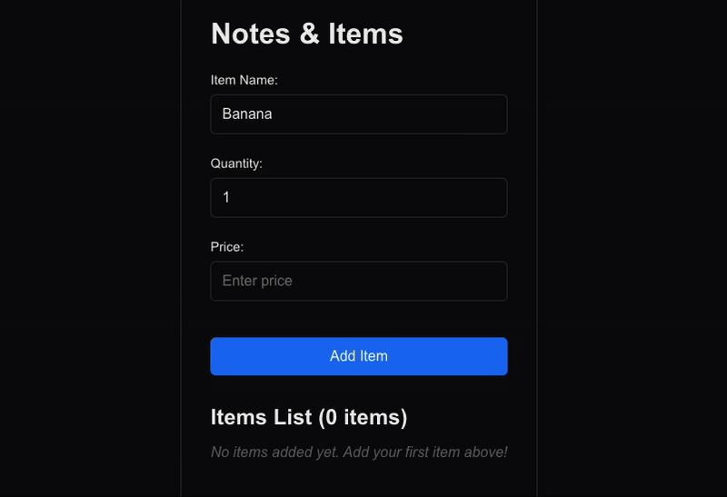
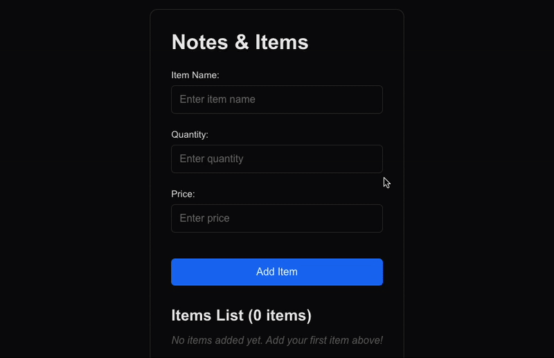

Hello! I'm Firdaus Al Ghifari (Alghi), a full-stack software engineer at Money Forward Cloud Payroll, HR Solutions Department. Recently, while working on our React application, I encountered an interesting challenge when handling numeric inputs for Japanese users. What seemed like a straightforward task—using `type="number"` for number inputs—turned out to be much more complex when considering the unique requirements of Japanese numeric input patterns.

In this article, I'll share my journey of discovering why simple number inputs don't work well in Japan and how I developed a comprehensive solution to handle various Japanese numeric input scenarios. We'll explore the challenges of supporting full-width characters, comma delimiters, and different decimal representations, and I'll provide a practical implementation using React Hook Form and Zod validation. By the end, you'll have a robust solution that handles all the edge cases of Japanese numeric input while maintaining a great user experience.

### Background

Whenever working with numbers in a form, using `type="number"` might be the most straightforward solution. But I found that it is not the most user friendly way to handle the number input in Japan. I investigated our existing Ruby on Rails app and tried out various input patterns. It turns out, they are able to handle many scenarios:

- Numbers with no comma delimiters (e.g., "1234567")
- Numbers with comma delimiters for better readability (e.g., "1,234,567")
- Decimal numbers (e.g., "123.45")
- Negative numbers (e.g., "-123")
- Full-width numeric characters commonly used in Japanese text input:
  - Digits: "０１２３４５６７８９"
  - Comma: "，"
  - Decimal point: "．"
  - Minus sign: "－"

For those who are not familiar with Japanese input systems, full-width characters (全角文字, zenkaku-moji) are an important concept to understand. In Japanese computing, characters can be either "half-width" (半角, hankaku) or "full-width" (全角, zenkaku):

- **Half-width characters**: Standard ASCII characters that take up one character width (like `1`, `,`, `.`, `-`)
- **Full-width characters**: Characters that take up two character widths, typically used in Japanese text (like `１`, `，`, `．`, `－`)

This distinction exists because Japanese writing systems combine multiple character sets (hiragana, katakana, kanji, and latin characters). To maintain visual consistency in text layout, full-width versions of numbers and symbols were created to match the width of Japanese characters.

Traditional `type="number"` inputs simply don't handle these cases gracefully, leading to poor user experience and validation errors.



As shown in the demo above, when using `type="number"`, it is not possible to input a number other than using half-width characters. Full-width characters and comma delimiters are not supported and will be treated as invalid characters.

### Our Solution

After several tries, I was able to create a helper function that was able to handle all these cases. Afterwards, I integrated the solution with React Hook Form and Zod.

#### a. Japanese Number Validator

The first function is a validator to check if a string is a valid Japanese number or not:

```typescript
import { parseInteger } from "@/utils/number";
import { z } from "zod";

const numberRegex =
  /^[ー−‒–—―﹣－-]?(?:[０-９\d][,，０-９\d]*(?:[．\.][０-９\d]+)?)?$/;

const isNumber = z
  .string()
  .refine(value => numberRegex.test(value), {
    message: "Invalid number",
  })
  .refine(value => parseInteger(value) >= -2000000000, {
    message: "Number must be greater than or equal to -2000000000",
  })
  .refine(value => parseInteger(value) <= 2000000000, {
    message: "Number must be less than or equal to 2000000000",
  });
```

The regex pattern `/^[ー−‒–—―﹣－-]?(?:[０-９\d][,，０-９\d]*(?:[．\.][０-９\d]+)?)?$/` handles:
- Optional negative signs (both half-width `-` and full-width `－` with all variations)
- Numbers (both half-width `0-9` and full-width `０-９`)
- Comma delimiters (both half-width `,` and full-width `，`)
- Decimal points (both half-width `.` and full-width `．`)
- Empty strings for better UX during typing

#### b. Japanese Number Converter

The second function converts a valid Japanese number string to a Number type:

```typescript
export const parseNumber = (value: string): number => {
  const cleanedValue = value
    .replace(/[,，]/g, "")
    .replace(/．/g, ".")
    .replace(/[ー−‒–—―﹣－]/g, "-")
    .replace(/[０-９]/g, digit =>
      String.fromCharCode(digit.charCodeAt(0) - "０".charCodeAt(0))
    );
  return Number(cleanedValue);
};

export const parseInteger = (value: string): number => {
  const parsedNumber = parseNumber(value);
  return Math.trunc(parsedNumber);
};
```

The conversion process of `parseNumber` is as follows:

1. Removes all comma delimiters (both half-width and full-width)
2. Converts full-width decimal points to half-width
3. Converts full-width negative signs to half-width
4. Converts full-width digits to half-width using Unicode character code conversion
5. Converts the cleaned string to a number

The `parseInteger` function will perform the same conversion process, but it will also remove the decimal part of the number.

### Integrating Validation and Conversion using React Hook Form and Zod

In order to seamlessly use the validation function and conversion function, we will show an example of building a notes App using NextJS, React Hook Form, and Zod. The app will be very simple, it will contain list of notes. Each note has three attributes: item name (string), item quantity (integer), and price (Japanese number).

You can try out and edit the complete working example directly in the CodeSandbox below:

[](https://codesandbox.io/p/github/falghi/example-zod-with-react-hook-form/main?embed=1)

Let's go through the code step by step.

#### 0. Prerequisites

Note that I'm using the following versions of the libraries:

- NextJS version 15.3.5
- React Hook Form version 7.60.0
- Zod version 4.0.5

#### 1. Define the schema

Let's create a file called `schema.ts` to define the schema for the form.

```typescript
import { parseInteger } from "@/utils/number";
import { z } from "zod";

const numberRegex =
  /^[ー−‒–—―﹣－-]?(?:[０-９\d][,，０-９\d]*(?:[．\.][０-９\d]+)?)?$/;

const isNumber = z
  .string()
  .refine(value => numberRegex.test(value), {
    message: "Invalid number",
  })
  .refine(value => parseInteger(value) >= -2000000000, {
    message: "Number must be greater than or equal to -2000000000",
  })
  .refine(value => parseInteger(value) <= 2000000000, {
    message: "Number must be less than or equal to 2000000000",
  });

export const itemSchema = z.object({
  name: z
    .string()
    .min(1, "Name is required")
    .max(100, "Name must be less than 100 characters"),
  quantity: z.number(),
  price: isNumber,
});

export type ItemData = z.infer<typeof itemSchema>;
```

#### 2. Define a hook to handle the form

For the form, we will use React Hook Form. We will create a hook called `useNotes` to handle the form.

```typescript
import { useState, useEffect } from "react";
import { useForm } from "react-hook-form";
import { zodResolver } from "@hookform/resolvers/zod";
import { itemSchema, type ItemData } from "./schema";
import { parseInteger } from "@/utils/number";

interface Item {
  id: string;
  name: string;
  quantity: number;
  price: number;
  createdAt: string;
}

const STORAGE_KEY = "notesItems";

export function useNotes() {
  const [items, setItems] = useState<Item[]>([]);
  const [totalValue, setTotalValue] = useState(0);

  const {
    register,
    handleSubmit,
    formState: { errors, isSubmitting },
    reset,
  } = useForm<ItemData>({
    resolver: zodResolver(itemSchema),
    mode: "onChange",
  });

  // Load items from localStorage on component mount
  useEffect(() => {
    const savedItems = localStorage.getItem(STORAGE_KEY);
    if (savedItems) {
      setItems(JSON.parse(savedItems));
    }
  }, []);

  // Calculate total value whenever items change
  useEffect(() => {
    const total = items.reduce(
      (sum, item) => sum + item.price * item.quantity,
      0
    );
    setTotalValue(total);
  }, [items]);

  const onSubmit = async (data: ItemData) => {
    const newItem: Item = {
      id: Date.now().toString(),
      name: data.name,
      quantity: data.quantity,
      price: parseInteger(data.price),
      createdAt: new Date().toISOString(),
    };

    const updatedItems = [...items, newItem];
    setItems(updatedItems);
    localStorage.setItem(STORAGE_KEY, JSON.stringify(updatedItems));
    reset();
  };

  const deleteItem = (id: string) => {
    const updatedItems = items.filter(item => item.id !== id);
    setItems(updatedItems);
    localStorage.setItem(STORAGE_KEY, JSON.stringify(updatedItems));
  };

  const clearAllItems = () => {
    setItems([]);
    localStorage.removeItem(STORAGE_KEY);
  };

  return {
    items,
    totalValue,
    register,
    handleSubmit,
    errors,
    isSubmitting,
    onSubmit,
    clearAllItems,
    deleteItem,
  };
}
```

#### 3. Define the page component

Let's create a file called `page.tsx` to define the page component.

```tsx
"use client";

import Link from "next/link";
import styles from "../page.module.css";
import { useNotes } from "./useNotes";
import { numberWithDelimiter } from "@/utils/number";

export default function Notes() {
  const {
    items,
    totalValue,
    register,
    handleSubmit,
    errors,
    isSubmitting,
    onSubmit,
    clearAllItems,
    deleteItem,
  } = useNotes();

  return (
    <div className={styles.page}>
      <main className={styles.main}>
        <div className={styles.container}>
          <h1 style={{ paddingBottom: "1rem" }}>Notes & Items</h1>

          <form onSubmit={handleSubmit(onSubmit)} className={styles.form}>
            <div className={styles.formGroup}>
              <label htmlFor="name">Item Name:</label>
              <input
                id="name"
                type="text"
                {...register("name")}
                placeholder="Enter item name"
                className={errors.name ? styles.error : ""}
              />
              {errors.name && (
                <span className={styles.errorMessage}>
                  {errors.name.message}
                </span>
              )}
            </div>

            <div className={styles.formGroup}>
              <label htmlFor="quantity">Quantity:</label>
              <input
                id="quantity"
                type="number"
                min="1"
                step="1"
                {...register("quantity", {
                  valueAsNumber: true,
                })}
                placeholder="Enter quantity"
                className={errors.quantity ? styles.error : ""}
              />
              {errors.quantity && (
                <span className={styles.errorMessage}>
                  {errors.quantity.message}
                </span>
              )}
            </div>

            <div className={styles.formGroup}>
              <label htmlFor="price">Price:</label>
              <input
                id="price"
                type="text"
                {...register("price")}
                placeholder="Enter price"
                className={errors.price ? styles.error : ""}
              />
              {errors.price && (
                <span className={styles.errorMessage}>
                  {errors.price.message}
                </span>
              )}
            </div>

            <button
              type="submit"
              disabled={isSubmitting}
              className={styles.submitButton}
            >
              {isSubmitting ? "Adding..." : "Add Item"}
            </button>
          </form>

          {/* Items List */}
          <div style={{ marginTop: "2rem" }}>
            <div
              style={{
                display: "flex",
                justifyContent: "space-between",
                alignItems: "center",
                marginBottom: "1rem",
              }}
            >
              <h2>Items List ({items.length} items)</h2>
              {items.length > 0 && (
                <button
                  onClick={clearAllItems}
                  style={{
                    background: "#dc3545",
                    color: "white",
                    border: "none",
                    padding: "0.5rem 1rem",
                    borderRadius: "4px",
                    cursor: "pointer",
                    fontSize: "0.9rem",
                  }}
                >
                  Clear All
                </button>
              )}
            </div>

            {items.length === 0 ? (
              <p
                style={{
                  textAlign: "center",
                  color: "#666",
                  fontStyle: "italic",
                }}
              >
                No items added yet. Add your first item above!
              </p>
            ) : (
              <div>
                {items.map(item => (
                  <div
                    key={item.id}
                    style={{
                      border: "1px solid #ddd",
                      borderRadius: "8px",
                      padding: "1rem",
                      marginBottom: "0.5rem",
                      display: "flex",
                      justifyContent: "space-between",
                      alignItems: "center",
                      background: "white",
                    }}
                  >
                    <div style={{ marginRight: "0.5rem" }}>
                      <h3 style={{ margin: "0 0 0.5rem 0", color: "black" }}>
                        {item.name}
                      </h3>
                      <p style={{ margin: "0", color: "#666" }}>
                        Quantity: {item.quantity} | Price:{" "}
                        {numberWithDelimiter(item.price)} | Total:{" "}
                        {numberWithDelimiter(item.price * item.quantity)}
                      </p>
                    </div>
                    <button
                      onClick={() => deleteItem(item.id)}
                      style={{
                        background: "#dc3545",
                        color: "white",
                        border: "none",
                        padding: "0.25rem 0.5rem",
                        borderRadius: "4px",
                        cursor: "pointer",
                        fontSize: "0.8rem",
                      }}
                    >
                      Delete
                    </button>
                  </div>
                ))}

                <div
                  style={{
                    borderTop: "2px solid #007bff",
                    paddingTop: "1rem",
                    marginTop: "1rem",
                    textAlign: "right",
                    fontWeight: "bold",
                    fontSize: "1.1rem",
                  }}
                >
                  Total Value: {numberWithDelimiter(totalValue)}
                </div>
              </div>
            )}
          </div>

          <div style={{ marginTop: "2rem", textAlign: "center" }}>
            <Link
              href="/"
              className={styles.submitButton}
              style={{ textDecoration: "none", display: "inline-block" }}
            >
              Back to Homepage
            </Link>
          </div>
        </div>
      </main>
    </div>
  );
}
```

#### 4. Define the styles

You can find the complete style definitions used in this example in the [`page.module.css` file on GitHub](https://github.com/falghi/example-zod-with-react-hook-form/blob/main/src/app/page.module.css). The styles include layout, form, button, and table formatting to create a clean and user-friendly interface.

Feel free to copy or adapt the styles from that file. You can place `page.module.css` in your page or component directory and adjust the import path as needed for your project structure.

### Final Result



With our implementation, users can now input numbers in various formats that feel natural to Japanese users:

- **Half-width numbers**: `123,456`
- **Full-width numbers**: `１２３，４５６`
- **Mixed format**: `123,４５６.5`
- **Negative numbers**: `-123,456` or `－１２３，４５６`

The validation provides clear error messages when:
- Invalid characters are entered (like alphabets)
- Multiple decimal points are used
- Numbers exceed the allowed range

### What's Next

This solution is a good starting point for handling Japanese numeric input in React. You can extend it to handle more scenarios, such as:

- Handling currency formatting (e.g., "¥1,234,567")
- Supporting different decimal separators (e.g., "," or ".")
- Localizing the error messages for different languages

### Wrapping Up

Thank you for reading this article 😄. If you have any questions, feel free to reach me via [LinkedIn](https://www.linkedin.com/in/alghi/) or other social media platforms.

Follow our [LinkedIn page](https://www.linkedin.com/company/money-forward/) so not to miss any blog and updates.

Happy coding!
