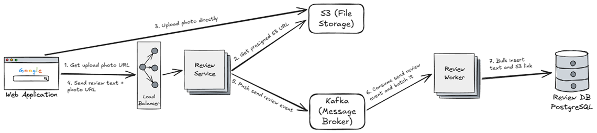

Hello! I'm Firdaus Al Ghifari (Alghi), a full-stack software engineer in Japan. Recently, I came across a system design problem that got me thinking: how would you build a nationwide food review app for Indonesia's **Makan Bergizi Gratis (MBG)** program, also called **Reviu MBG**, where students and teachers submit daily feedback on their catered meals?

The feature set is small, but the user base is huge. If tens of millions of people could submit a review at roughly the same time, what would the architecture look like? In this article, I'll walk through how I'd approach that problem using the 4-step system design framework from Alex Xu's book, *System Design Interview – An Insider's Guide*.

## The Problem

Picture yourself in a system design interview. The interviewer asks you to design a food review app used by Indonesian students and teachers to rate their daily school catering.

System design questions often start with vague requirements. That can feel overwhelming at first, but the key is to stay calm and ask the right questions before jumping into solutions.

## Step 1 - Understand the Problem and Establish the Scope

Here is an example dialogue for figuring out the requirements:

- **Candidate:** What specific features do we need to build?
- **Interviewer:** Mainly the review feature. Users submit feedback on their meal.
- **Candidate:** What information can a user send?
- **Interviewer:** Their name, a rating on a 1–5 scale, a free-text comment, and optionally a photo.
- **Candidate:** Is it a mobile app or a web app?
- **Interviewer:** Either is fine. Pick whichever is simplest.
- **Candidate:** Let's go with a web app. How many users will leave reviews, and how often?
- **Interviewer:** All Indonesian students and teachers will use it, and they can leave reviews daily.
- **Candidate:** Is submitting a review mandatory or optional?
- **Interviewer:** Completely optional.
- **Candidate:** Do users need to log in to post a review?
- **Interviewer:** You can decide.
- **Candidate:** Let's skip login to keep friction low. How will users receive the review link?
- **Interviewer:** A QR code printed on each food package.

At this point, the scope is clear: a simple web app for optional daily meal reviews, shared via QR codes on food packages, serving a nationwide user base.

## Step 2 - Propose a High-Level Design and Get Buy-In

This step has two parts: sketch a simple system blueprint, then run back-of-the-envelope calculations to check if the design can handle the load. Because the user base is so large, I prefer doing the capacity estimation first. It helps us pick the right architecture early.

### Back-of-the-Envelope Calculation

Using recent demographic data, let's round the potential user base to **60 million**. Since reviews are optional, I'll assume **15% of users submit one review per day**. For a worst case, I'll also assume most of those submissions happen during the lunch hour of **12:00–13:00 WIB** (Western Indonesian Time).

**Daily review volume:**

- 60 million users × 15% = **9 million reviews per day**

**Peak write load (worst case within the lunch hour):**

- 9 million reviews ÷ 3,600 seconds = **2,500 requests per second (RPS)**
- Applying a 4× spike multiplier: 2,500 × 4 = **10,000 peak RPS**

Each review submission is a write operation, so the system must handle roughly **10,000 writes per second (WPS)** at peak.

To put this in perspective, Visa processes a global average of about 2,000 transactions per second (TPS), with network capacity designed for peaks above 83,000 TPS. A nationwide lunch rush is surprisingly close to the scale of a global payment network. (Note: WPS can be several times higher than TPS for the same user activity, since a single user action may trigger multiple database writes.)

### High-Level Design

The data model is structured and relational (Catering Vendor → Daily Campaign → Food Review), so a relational database is a good fit. I'd choose **PostgreSQL** for its reliability and solid concurrent-write performance.

That said, a standalone PostgreSQL instance typically handles up to around **2,000 concurrent writes per second** before it starts to slow down. At 10,000 WPS, writing directly to the database won't work.

The solution is to **separate the client write path from the database** using an event-driven architecture:

1. The API accepts incoming reviews right away.
2. Reviews are pushed to a message broker (e.g., Kafka).
3. Background workers pull messages and batch multiple reviews into a single SQL statement.

This queued, batched approach handles the lunch-hour spike without needing database sharding.

One more thing to consider: **image uploads**. With an event-driven queue in place, we should not push large binary payloads through the message broker because that would slow things down. Instead, photos should be uploaded directly to object storage (S3) before the review text is submitted.

Here is the resulting high-level architecture:

## Step 3 - Design Deep Dive

After presenting the high-level design, an interviewer may ask you to go deeper on specific parts like data models, storage estimates, or implementation details. At this stage, work with the interviewer to focus on what they care about most.

For this walkthrough, I'll focus on the **Review** data model and how much storage the photos need.

### Reviews Table Structure

This table stores user reviews for each daily meal package.

- `review_id` (UUID, Primary Key), 16 bytes: Client-generated unique ID to prevent duplicate submissions
- `campaign_id` (UUID, Foreign Key), 16 bytes: Links the review to a specific daily catering campaign
- `rating` (SMALLINT), 2 bytes: Rating on a 1–5 scale
- `comment` (TEXT), ~200 bytes: Optional free-text review (average length)
- `photo_url` (VARCHAR), ~100 bytes: Optional URL pointing to the image in S3
- `created_at` (TIMESTAMP), 8 bytes: When the review was created
- `updated_at` (TIMESTAMP), 8 bytes: When the review was last modified

Each row is roughly **350 bytes**. Rounding up to **500 bytes** per row (including index overhead and page padding):

- Daily growth: 9 million × 500 bytes ≈ **4.5 GB/day**
- Yearly growth (240 school days): ≈ **1.1 TB/year**

### S3 Object Storage (Photos)

Assuming **20% of reviews include a photo**, and the frontend compresses images to an average of **300 KB** before upload:

- Daily upload volume: 9 million × 20% = **1.8 million photos/day**
- Daily S3 volume: 1.8 million × 300 KB ≈ **540 GB/day**
- Yearly S3 volume: 540 GB × 240 school days ≈ **130 TB/year**

130 terabytes per year is a good reason to keep photos in **object storage**, not the database. It also shows why we need **lifecycle policies**, like moving photos older than 90 days to cheaper tiers such as S3 Infrequent Access or Glacier.

### Bonus: Cost Estimation

Cost estimation is uncommon in live interviews, but it helps us understand the real cost of our design. Here's a rough monthly budget for the review system.

#### Storage Layer

- **Database storage:** ~1.1 TB on AWS Aurora ≈ **$110/month** ($0.10/GB)
- **Photo storage:** 130 TB in S3 Standard would cost nearly **$3,000/month**, but moving photos older than 90 days to S3 Glacier Instant Retrieval brings the average cost down to roughly **$1,200/month**

#### Compute and Message Broker

- **Core database (AWS Aurora PostgreSQL):** Multi-AZ `db.r6g.large` cluster ≈ **$360/month**
- **Message ingestion (AWS MSK):** 3-broker production cluster ≈ **$600/month**
- **App processing (AWS ECS on Fargate):** 5-instance baseline, scaling to 40 during the 3-hour lunch window ≈ **$500/month**

#### Networking and CDN

Students only download the lightweight web app and small menu metadata (~50 KB per session):

- 9 million users × 50 KB ≈ **450 GB/day**
- ~20 school days per month → ≈ **9 TB/month** of data transfer
- AWS CloudFront at ~$0.02/GB ≈ **$180/month**

#### Monthly Budget Summary

Combining the layers above:

- **Core ingestion** (storage, compute, CDN): ~$2,950/month
- **Observability and logging** (e.g., Datadog): ~$1,500/month
- **Security** (WAF, Secrets Manager, etc.): ~$450/month
- **Staging and development environments**: ~$1,000/month
- **Total (review feature only)**: ~$6,000/month

The review feature is the heaviest part of the system. Adding supporting features like admin panels, vendor dashboards, and campaign management might push the total cost roughly **50% higher**, landing around **~$9,000/month** (~Rp 162 million at ~Rp 18,000/USD).

### A Quick Reality Check

We designed for a scenario where up to 60 million users could submit reviews during a nationwide lunch rush. In practice, the real-world setup may be much simpler. If students never access the app directly and only school admins or catering vendors log the feedback, traffic drops sharply, and so does the server bill.

## Wrapping Up

Designing for a nationwide lunchtime spike sounds scary at first, but clear steps make it easier to handle. By estimating capacity early, choosing PostgreSQL for relational data, and using a message queue to handle traffic spikes and batch writes, we can handle ~10,000 WPS without sharding a database.

The rough monthly cost for this scale comes to about **$9,000 (~Rp 162 million)** for a production-ready nationwide system, but the actual bill depends on who submits reviews and when.

The next time a system design question feels overwhelming, don't panic. Ask questions, estimate capacity, propose a simple architecture, and go into the details with your interviewer.

Thank you for reading this article 😄. If you have any questions or want to discuss system design, feel free to reach out via [LinkedIn](https://www.linkedin.com/in/alghi/) or my other social media platforms.

Happy coding!
